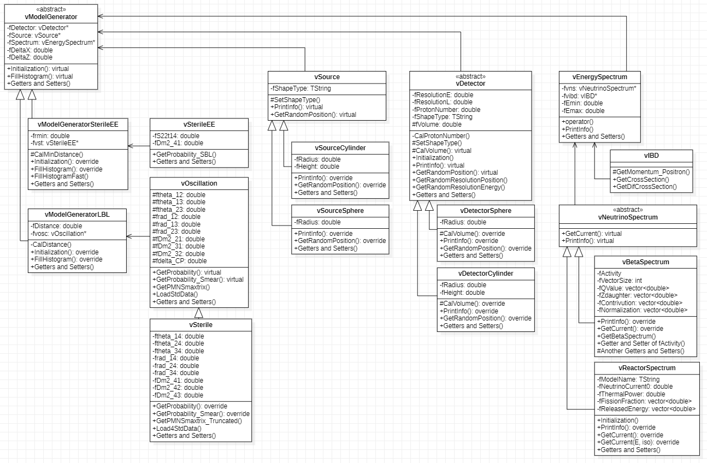

# vOscillating
This Project is for the calculation tool for the detection of neutrino with inverse beta decay.

This class need to be used with ROOT(CERN).


-----------------------
## How to download
> git clone https://github.com/jangddol/vOscillating.git


-----------------------
## Structure and Hierarchy


The file "vClass.hh" is not a class file.


-----------------------
## How to include
``` C++
#include "vClass.hh"
```


## Code Discription


